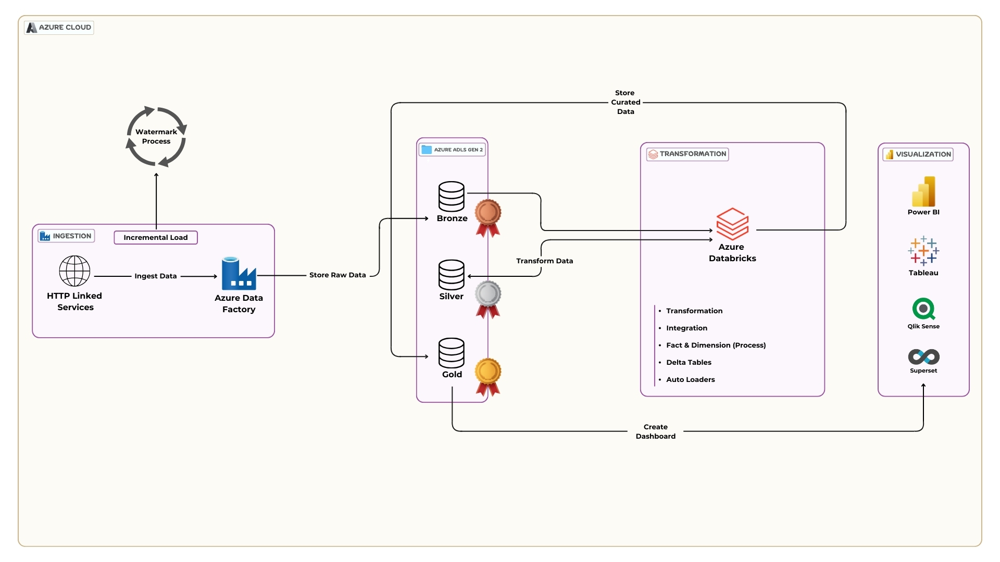
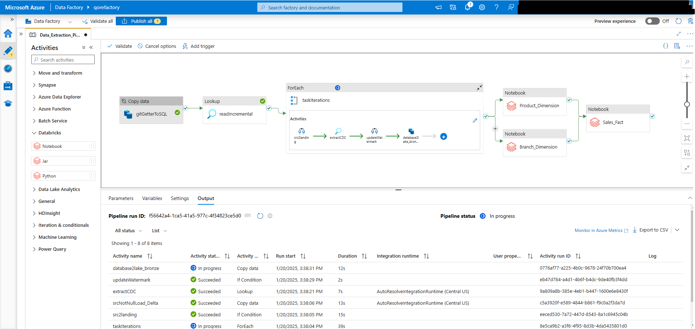

# Azure Data Factory/Databricks - Data Engineering Pipeline

This repository documents the **Data Engineering Pipeline** built using **Azure Data Factory (ADF), Databricks and Azure Data Lake - ADLS Gen2** using **Medallion Architecture**. The pipeline automates data extraction, loading and transformation (ELT) processes, with support for incremental data loads and advanced transformations. This repo will help freshners and newbies to understand the core concepts including slowly changes dimensiions[1,2], merge concept in datalake, delta format and much more...

---

## Table of Contents
1. [Introduction](#introduction)
2. [Tags](#tags)
3. [Architecture Overview](#architecture-overview)
4. [Pipeline Components](#pipeline-components)
5. [Data Transformation](#data-transformation)
6. [Key Features](#key-features)
7. [Settings and Configurations](#settings-and-configurations)
8. [Monitoring and Logs](#monitoring-and-logs)
9. [Setup and Deployment](#setup-and-deployment)
10. [Future Enhancements](#future-enhancements)

---

## Introduction

This pipeline automates the extraction, loading and transformation (ELT) process. It integrates **Azure Data Factory** and **Databricks** for scalable and efficient data processing. The design supports both batch and incremental data loads.

---

## Tags

- **Tools**: Azure Data Factory, Azure Databricks, SQL Database, Data Lake
- **Technologies**: ELT, Change Data Capture (CDC), Incremental Data Processing, Big Data
- **Features**: Parallel Processing, Metadata-Driven Pipeline, Watermarking

---

## Architecture Overview

1. **Source Systems**: Data is ingested from a Git repository.
2. **Staging Area**: Data is moved to a SQL database for preprocessing.
3. **Transformation**: Data is cleaned and transformed using ADF and Databricks.
4. **Storage**: Processed data is stored in a data lake and dimension/fact tables.

---

## Pipeline Components

### 1. Copy Data (gitGetterToSQL)

- **Purpose**: Copies data from the Git repository to SQL staging.

### 2. Lookup (readIncremental)

- **Purpose**: Reads metadata to determine incremental data ranges.

### 3. ForEach (taskIterations)

- **Purpose**: Iterates through datasets or tasks for parallel processing.
- **Sub-Activities**:
  - `src2landing`: Moves data to the landing zone.
  - `extractCDC`: Extracts incremental (CDC) data.
  - `updateWatermark`: Updates processing metadata.
  - `database2lake_bronze`: Moves structured data to the data lake's bronze layer.

---

## Data Transformation

### Databricks Notebooks

- **Product_Dimension**: Handles product-related data transformation to create SCD2 .
- **Branch_Dimension**: Processes branch-specific data to handle SCD1.
- **Sales_Fact**: Creates fact tables for sales metrics.

---

## Key Features

- **Incremental Data Processing**: Processes only new or updated records.
- **Parallel Execution**: Speeds up execution using the `ForEach` activity.
- **Watermarking**: Tracks last processed data for incremental loads.
- **Advanced Transformations**: Uses Databricks for data modeling and analytics.

---

## Settings and Configurations

### Pipeline Parameters

- **Source System**: Define the data source (e.g., Git repo connection string).
- **Watermark Configuration**:
  - `Last Processed Timestamp`: Tracks incremental loads.

### Linked Services

- **SQL Database**: For staging and intermediate data processing.
- **Data Lake**: For storing processed data.
- **Databricks Workspace**: For advanced transformations.

### Integration Runtime

- Uses **AutoResolveIntegrationRuntime** for data movement.

---

## Monitoring and Logs

- **Pipeline Status**: Provides status, runtime, and duration for each activity.
- **Error Logs**: Captures failures for debugging.
- **Monitoring Tools**: Azure Monitor and Log Analytics can be integrated for advanced tracking.

---

## Setup and Deployment

### Prerequisites

1. Azure Subscription with Data Factory enabled.
2. Databricks Workspace configured.
3. Required permissions for source and destination systems.

### Deployment Steps

1. Clone this repository.
2. Create your own tables [watermark and transactional], you can skip this stepbut you will need a little modification in pipeline ;)
3. Import the pipeline JSON into Azure Data Factory.
4. Import the notebooks in databricks
5. Configure the linked services.
6. Run the pipeline with test data to verify the setup.

---

## Future Enhancements

- Add real-time data ingestion using Event Hubs or Kafka.
- Enhance monitoring with detailed dashboards in Power BI or Grafana.
- Automate deployment with CI/CD pipelines (e.g., GitHub Actions or Azure DevOps).

